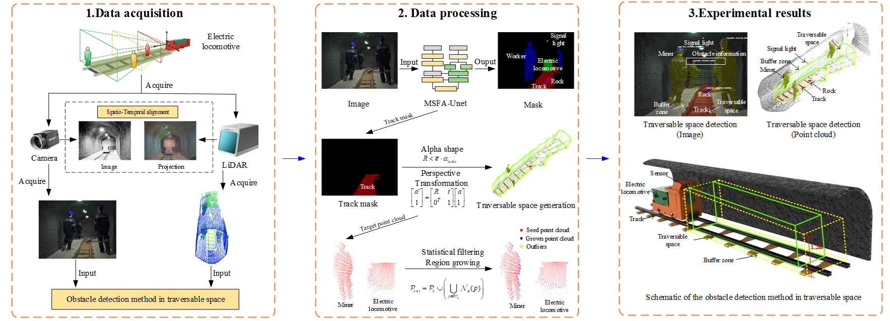
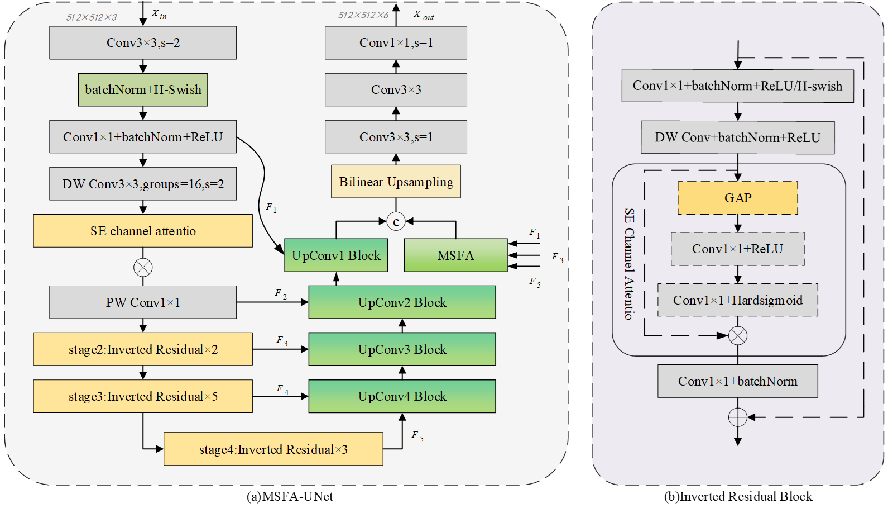
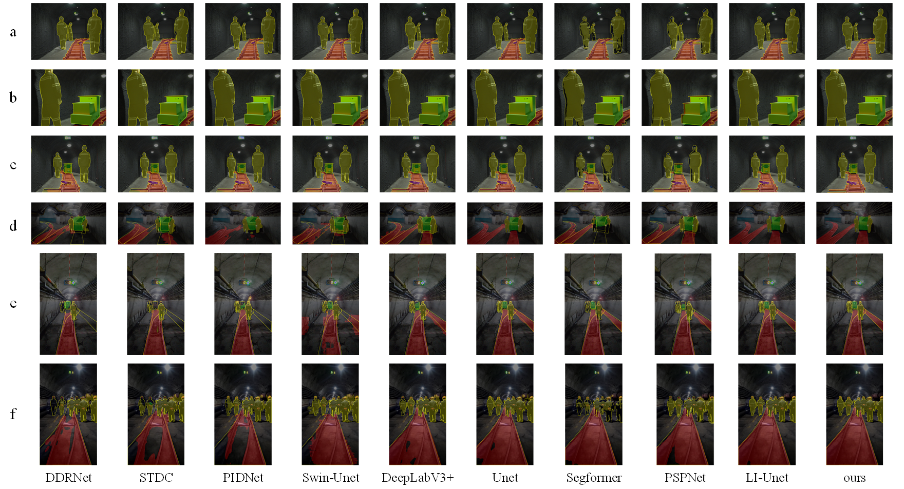
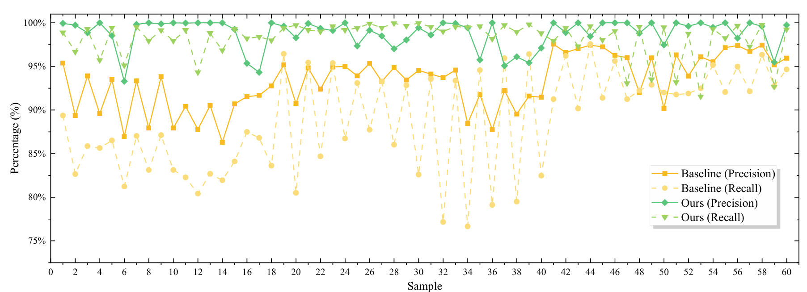
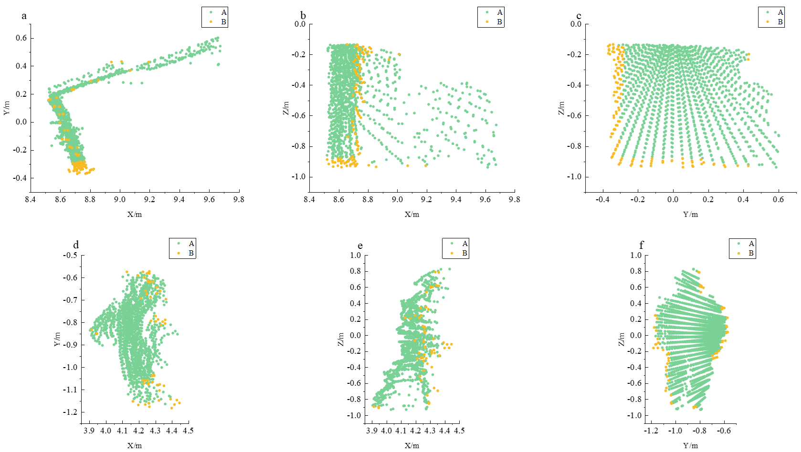
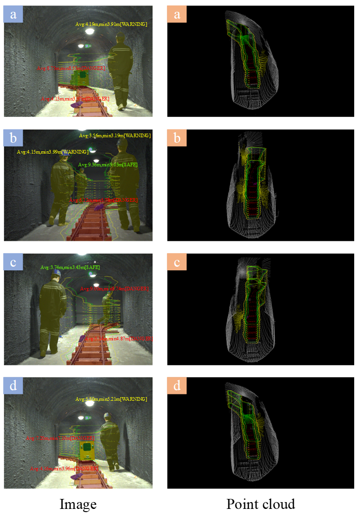

 ---

# Obstacle Perception Method for Autonomous Electric Locomotives Based on Visual Semantic Guidance and LiDAR Point Cloud Spatial Constraints

## 📄 Paper Overview

### 📝 Abstract

> To mitigate the frequent false alarms and unnecessary braking of autonomous electric locomotives in underground coal mines induced by the indiscriminate detection of all scene objects, an obstacle perception method based on visual semantic guidance and LiDAR point cloud spatial constraints is proposed. The MSFA-Unet semantic segmentation network is constructed using MobileNetV3 as the backbone and incorporating a multi-scale feature aggregation module in the decoding layer, which achieves a joint optimization of obstacle segmentation accuracy and real-time detection speed. To solve the point cloud offset of moving targets caused by time synchronization errors between the monocular camera and LiDAR, a point cloud growing and offset repair method guided by visual semantic information is introduced, realizing the offset calibration and precise 3D localization of moving target point clouds. Furthermore, a traversable space model containing a safety zone and a buffer zone is constructed based on the alpha shape algorithm, where track geometric constraints are utilized to eliminate perception artifacts in narrow roadway environments. Experimental results demonstrate that the proposed method achieves an MIoU of 88.64% in the semantic segmentation task and a real-time processing speed of 127.21 FPS, while the precision and recall of moving target point clouds reach 98.80% and 98.27%, respectively. This approach avoids frequent start-stop events caused by false detections and enhances the operational continuity and safety of autonomous locomotives in underground mines, thereby providing support for AI-driven dynamic risk decision-making and adaptive control of autonomous vehicles in coal mines

---

### 🔍 Method Description

This study employs a monocular camera and LiDAR to acquire spatiotemporally synchronized multimodal data. First, high-precision semantic masks are extracted from images via the MSFA-Unet network to serve as 2D spatial priors. Subsequently, the masks are mapped into 3D space through a perspective projection transform, which guides the precise cropping and segmentation of the point cloud. To address the point cloud offset of moving targets caused by time synchronization errors, a visual-semantic-guided point cloud growing algorithm is proposed to achieve the adaptive correction of offset point clouds utilizing visual semantic information. Finally, precise track boundaries are extracted from the point cloud using track masks. By integrating these boundaries with the Alpha Shape algorithm, a 3D traversable space model comprising a safety zone and a buffer zone is constructed. This model subsequently determines the spatial intrusion states of targets, enabling the implementation of hierarchical early warning and interlocking control based on target types and intrusion states.The overall workflow of the proposed method is illustrated in Fig. 1.



---

### ✨ Visualization Results


---

### Semantic Segmentation Network Architecture

The network architecture is shown in Figure 2:



Pseudocode for point cloud growth and offset correction is shown in Figure 3:


---

## 📊 Experimental Results and Analysis

### 1. Semantic Segmentation Model (MSFA-Unet) Comparison

To validate the effectiveness of the proposed MSFA-Unet, we compare it with other state-of-the-art semantic segmentation models:

| Model Name    |  MIoU (%) |   PA (%)  | mRecall (%) |     FPS    |
| :------------ | :-------: | :-------: | :---------: | :--------: |
| LR-ASPP       |   44.20   |   87.28   |    51.77    |    74.22   |
| FCN           |   44.85   |   86.39   |    52.90    |    53.79   |
| Bisenetv1     |   54.64   |   93.49   |    63.12    |   138.51   |
| DDRNet        |   61.90   |   93.49   |    63.12    |   149.20   |
| STDC          |   64.62   |   93.66   |    65.63    |   237.75   |
| PIDNet        |   67.97   |   95.12   |    73.70    |   200.38   |
| Swin-Unet     |   77.04   |   93.67   |    84.07    |    87.84   |
| DeepLabV3+    |   80.60   |   96.58   |    90.66    |    60.45   |
| UNet          |   82.57   |   95.97   |    88.12    |    82.57   |
| SegFormer     |   85.13   |   98.21   |    90.73    |   196.97   |
| PSPNet        |   86.63   |   97.72   |    92.82    | **255.23** |
| LI-Unet       |   87.45   | **97.81** |    92.72    |    63.77   |
| **MSFA-Unet** | **88.64** |   97.45   |  **94.26**  |   127.21   |

Qualitative results of MSFA-Unet are shown below:



---

### 2. Point Cloud Growth and Offset Correction Analysis

Quantitative evaluation of the proposed method:

| Method   |  Precision |   Recall   |
| :------- | :--------: | :--------: |
| Baseline |   93.25%   |   88.82%   |
| Ours     | **98.80%** | **98.27%** |

Statistical analysis over 60 motion samples is shown in Figure 5:



Visualization results:



---

### 3. Visualization of traversable space.



---

## Code for Paper Verification: Semantic Segmentation Inference, Evaluation, and Point Cloud Region Growing

### Description

This repository currently provides inference and evaluation code for the core algorithms in the paper. Full code, preprocessing pipelines, and datasets will be released after the paper is officially accepted.

---

### Environment Setup

Install dependencies in an Anaconda environment:

```powershell
cd your_project
conda activate your_env
pip install -r requirements.txt
```

For GPU support, install the appropriate `torch` version according to your CUDA version from the [PyTorch official website](https://pytorch.org), then install other dependencies.

---

## Usage Instructions

### 1. Generate Semantic Segmentation Outputs

Script: `gen_seg_outputs.py`

Outputs three types of results:

| Subdirectory | Description                 |
| ------------ | --------------------------- |
| blended/     | Original image with overlay |
| color/       | Colored masks               |
| origin/      | Grayscale label maps        |

**VOC-style input:**

```powershell
python gen_seg_outputs.py --read-mode test_txt --test-txt path/to/test.txt --jpeg-dir path/to/JPEGImages --out-dir out --model path/to/weights.pth
```

Example:

```powershell
python gen_seg_outputs.py --read-mode test_txt --test-txt ./dataset/VOC2007/test.txt --jpeg-dir ./dataset/VOC2007/JPEGImages --out-dir out --model ./weights/best.pth
```

---

### 2. Semantic Segmentation Evaluation

Script: `eval_msfa_unet.py`

Computes mIoU, Precision, Recall, F1, Accuracy, and FPS.

Dataset structure:

```
dataset/
  VOC2007/
    test.txt
    JPEGImages/
    SegmentationClass/
```

Configure in `EvalConfig`:

* `VOCdevkit_path`
* `model_path`
* `num_classes`, `name_classes`, `input_shape`

Run:

```powershell
conda activate your_env
python eval_msfa_unet.py
```

---

### 3. Point Cloud Region Growing Evaluation

Script: `eval_region_grow.py`

Compares baseline and region-growing results.

**Inputs:**

* Baseline: `base.xlsx`
* Region growing: `base_region_grow.xlsx`
* Ground truth: `base.pcd`

Run:

```powershell
python eval_region_grow.py --origin-dir path/to/xlsx_dir --label-dir path/to/pcd_dir --region-grow-dir path/to/rg_xlsx_dir
```

Example:

```powershell
python eval_region_grow.py --origin-dir ./dataset/pcd_offset_compensation/seg_zy --label-dir ./dataset/pcd_offset_compensation/seg_zy_label
```

Results are saved to:

```
out/eval_region_grow_results.xlsx
```

---

### Dataset and Model Weights

[Download dataset and weights](https://pan.baidu.com/s/1CVguEKNr28mQ_zb6uRjUsA?pwd=dfmf)

---